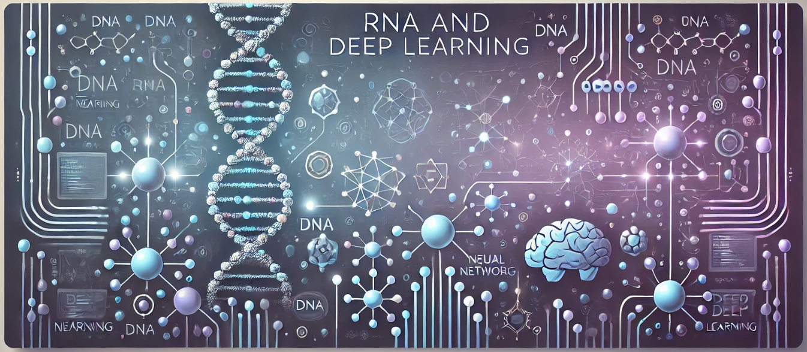

# RNA e Deep Learning - CESAR School 2024.01

## Aluno
> Nome: Marlos Ribeiro  
> E-mail: mgrb@cesar.school

## Instruções

A cada entrega de Atividades (AT) está em uma pasta, e para a entrega do Trabalho Final (TF), está numa pasta chamada "Trabalho Final".

## Estrutura do repositório
```
📁 ./
├── 📁 Atividades
│   ├── 📁 1 - Intro
│   │   ├── 📊 clusters.csv
│   │   ├── 📓 Perfils_Clustering.ipynb
│   │   └── 📊 PesquisaPerfis.csv
│   └── 📁 2 - Linear Regretion
├── 📁 docs
│   └── 🖼️ banner.png
├── 📄 pyproject.toml
├── 📄 README.md
├── 📁 Trabalho Final
└── 🔒 uv.lock   
```
